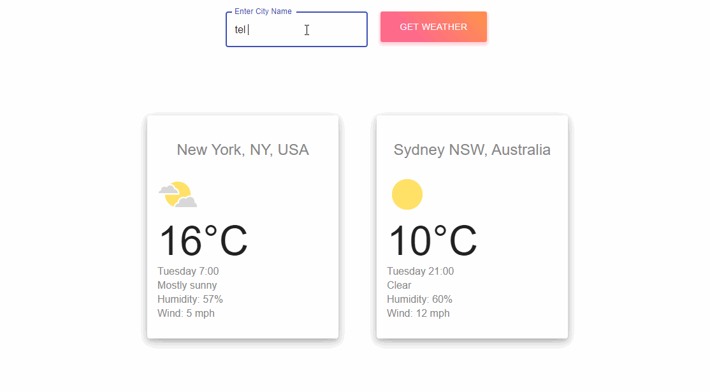

## Weather website.
A web page that scrapes, crawls and utilizes REST API. The page presents weather information anywhere in the world.

## Project Screen Shot.


## Installation and Setup Instructions.
Clone down this repository. You will need [node](https:https://nodejs.org/en/) and [npm](https:https://nodejs.org/en/) installed globally on your machine. 

To install:
```bash
npm install
```
To Start Server:
```bash
npm start  
```
To Visit App:
[http://localhost:3000]

## About the project.
I wanted to build a web page that web crawl google search engine and display Weather data  in real time.

The data update in real time without any user interaction.

The web page displaying the following:
1. Current weather data for two cities New York and Sydney.
2. An input field to allow the user to search any other location in the world.

the weather data include:
1. Location name
2. Temperature
3. Humidity
4. Windspeed
5. Icon for the current weather state.
6. last update time Stamp.


